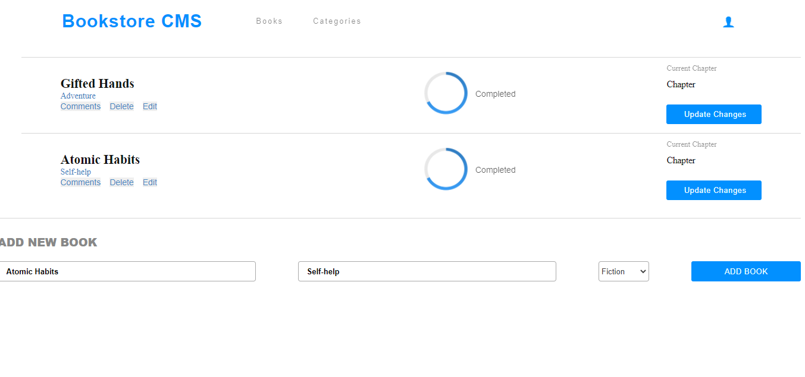

# BookStore

> BookStore is project built using React and redux.

# Home Page 

Additional description about the project and its features.

# Built With

### Major languages
- HTML
- CSS
- JS
- JSX

### Frameworks/Libraries
- React

## Live Demo

[Click here](https://bookstores-tchilo.netlify.app/) 

## Getting Started

To get a local copy up and running follow these simple example steps.
```
git clone git@github.com:Tchilo/BookStores

cd BookStores

npm i 

npm start 
```

### Prerequisites
```
node modules 
```
### Setup

In the project directory, you can run:

### `npm start`

Runs the app in the development mode.\
Open [http://localhost:3000](http://localhost:3000) to view it in the browser.

The page will reload if you make edits.\
You will also see any lint errors in the console.


### `npm run build`

Builds the app for production to the `build` folder.\
It correctly bundles React in production mode and optimizes the build for the best performance.

The build is minified and the filenames include the hashes.\
Your app is ready to be deployed!

See the section about [deployment](https://facebook.github.io/create-react-app/docs/deployment) for more information.

### Install

### Run tests

Launches the test runner in the interactive watch mode.\
See the section about [running tests](https://facebook.github.io/create-react-app/docs/running-tests) for more information.

### Deployment


## Author

- GitHub: [Tchilo](https://github.com/Tchilo)


## 🤝 Contributing

Contributions, issues, and feature requests are welcome!

Feel free to check the [issues page](../../issues/).

## Show your support

Give a ⭐️ if you like this project!

## Acknowledgments

- Hat tip to anyone whose code was used
- Inspiration
- etc

## 📝 License

This project is [MIT](./MIT.md) licensed.